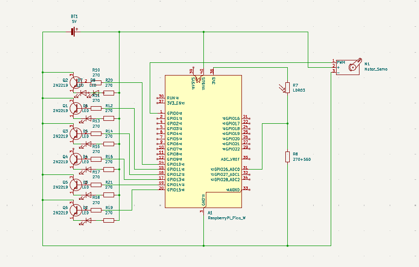
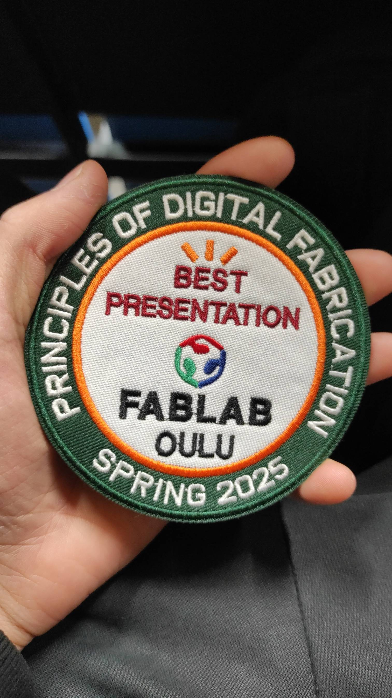

# Oulu University PoDF Spring 2025 Group 17 Smart Home System
This Is The Repo For The Smart Home Project Of Group 17

This project is a basic smart home control system built around a Raspberry Pi Pico. It allows users to control virtual lights and a garage door through a simple web interface accessible over a local WiFi network. Additionally, it incorporates an LDR sensor to enable automatic light control based on the ambient light level. The system consists of Python code running on the Pico that manages the hardware components, hosts the web server, and handles user commands.

The smart home system utilizes a Raspberry Pi Pico as its controller, managing seven LEDs to represent lights and a servo motor for garage door operation. Current-limiting resistors (12 x 270 Ohms) protect the LEDs, while a 560 Ohm resistor, along with one 270 Ohm resistor, creates a voltage divider circuit to measure light levels for automatic lighting control. Six transistors act as switches to control current flow to the LEDs or servo. A breadboard facilitates easy connection of these components, and jumper cables provide the necessary wiring.

The codebase for this smart home system comprises four main Python files that work together to control lights and a garage door via a web interface and automated light sensing. main.py serves as the central control script, initializing and managing Light and Door objects, processing commands from the web server, and implementing automatic lighting based on LDR sensor readings. server.py handles the web server functionality, enabling WiFi connectivity, serving the user interface, and managing HTTP requests to control devices and retrieve their status. The light.py file defines the Light class to control individual lights, while door.py defines the Door class to manage the servo motor for the garage door. The code uses threading to handle concurrent operations and JSON for data exchange between the server and the client.

For the project and the presentation, we earned the Best Presentation title
